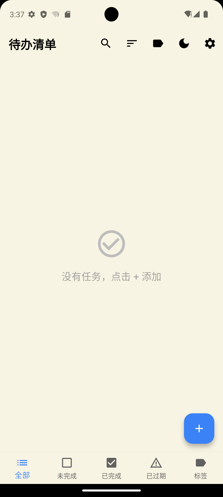
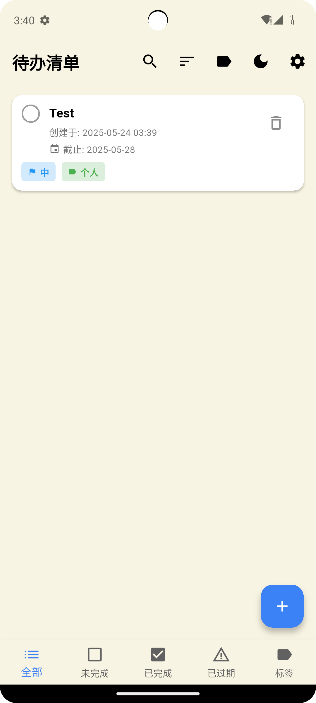

# Flutter 待办清单应用 (My Todo Journal)

一个使用 **Flutter** 开源框架编写的事件清单程序。支持中文输入，添加、删除、标记任务状态，记录任务创建时间，并实现本地保存。

  
  

---

## 功能特性

### 基础功能
- **添加**：右下角按钮实现添加任务
- **删除**：任务卡片尾部有删除图标
- **标记完成**：任务卡片首部有修改当前状态的图标
- **创建时间**：创建的任务附带创建时间记录
- **本地存储**：创建的任务将会保存到本地存储

### 新增功能
- **任务优先级**：可设置任务为低/中/高三种优先级，并以不同颜色标识
- **截止日期**：可为任务设置截止日期，过期任务将高亮显示
- **任务筛选**：底部导航栏可按全部/未完成/已完成/已过期筛选任务
- **多种排序**：支持按创建时间、截止日期或优先级排序
- **空状态提示**：当筛选条件下无任务时，显示友好提示
- **深色模式**：支持深色模式和浅色模式切换
- **主题定制**：可选择预设主题颜色或自定义颜色
- **标签系统**：支持创建、编辑和删除标签，为任务分类
- **按标签分组**：可按标签筛选和查看任务
- **任务搜索**：支持按标题和标签搜索任务
- **每日通知**：支持为未完成任务设置每日提醒通知

---

## 使用指南

### 添加任务
1. 点击右下角的 **+** 按钮
2. 输入任务标题
3. 选择任务优先级（默认为"普通"）
4. 可选择设置截止日期
5. 可选择开启每日通知提醒
6. 可选择分配标签
7. 点击"添加"按钮完成

### 筛选任务
- 点击底部导航栏的不同选项卡切换筛选条件
- **全部**：显示所有任务
- **未完成**：仅显示未完成的任务
- **已完成**：仅显示已标记完成的任务
- **已过期**：显示已过期但未完成的任务
- **标签**：按标签分组显示任务

### 标签管理
- 点击右上角的标签图标进入标签管理页面
- 可以添加、编辑和删除标签
- 每个标签可设置不同的名称和颜色
- 在"标签"筛选模式下，可选择特定标签查看相关任务

### 搜索任务
- 点击右上角的搜索图标进入搜索页面
- 在搜索框中输入关键词，应用会实时过滤匹配的任务
- 可以选择特定标签进一步缩小搜索范围
- 搜索结果中可以直接标记任务完成或删除任务

### 排序任务
- 点击右上角的排序图标打开排序选项
- 可选择按创建时间、截止日期或优先级排序
- 再次点击同一排序选项可切换升序/降序

### 主题设置
- 点击右上角的月亮/太阳图标可快速切换深色/浅色模式
- 点击设置图标进入主题设置页面，可以：
  - 开启/关闭深色模式
  - 选择预设主题颜色（蓝色、绿色、紫色等）
  - 设置自定义颜色

---

## 编译环境

- **语言**：Dart
- **框架**：Flutter

---

## 性能优化

为了确保应用在各种设备上的流畅运行，我们进行了以下优化：

1. **渲染优化**：
   - 使用轻量级组件替代重量级组件（如用自定义容器替代FilterChip）
   - 减少不必要的重建和布局计算
   - 优化列表渲染，避免频繁重绘

2. **错误处理**：
   - 增强了UUID生成的错误处理，失败时使用时间戳作为备用ID
   - 添加了全局错误捕获机制，记录未捕获的异常
   - 优化了错误显示界面，提供更友好的用户体验

3. **内存管理**：
   - 限制应用仅支持竖屏模式，减少布局计算负担
   - 添加了更多的空值检查，避免空指针异常
   - 优化对象创建和销毁，减少内存压力

4. **安卓模拟器兼容性**：
   - 修复了在某些安卓模拟器上添加任务时可能出现黑屏的问题
   - 优化了UI组件渲染方式，提高在低性能设备上的表现
   - 简化了复杂界面组件，减少渲染压力

---

## 项目改进方向

- 实现任务拖拽排序功能
- 实现数据备份与恢复
- 支持多语言
- 实现标签颜色自动应用到任务卡片
- 进一步优化应用在低性能设备上的表现

---

## 资源引用

部分素材来源于网站：https://www.flaticon.com/
